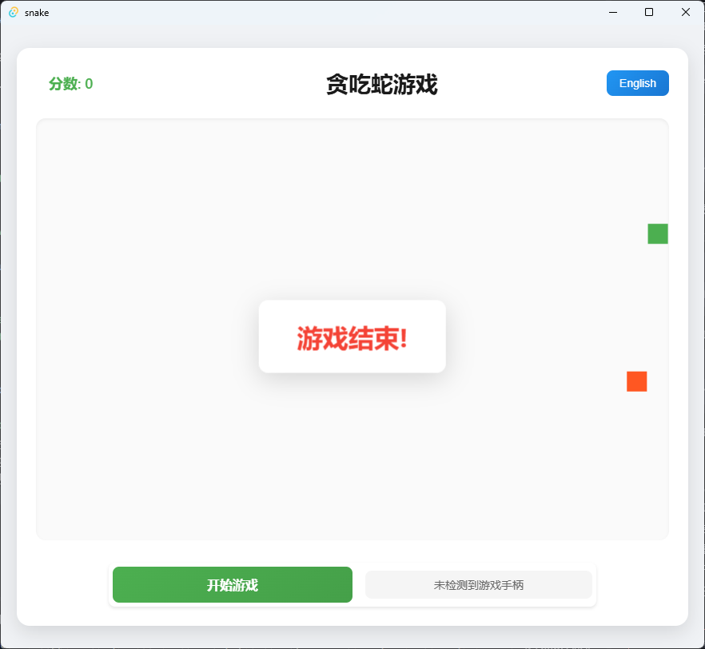

# Tauri + Vue 3 Snake Game | 贪吃蛇游戏

A snake game developed with Tauri + Vue 3.

一个使用 Tauri + Vue 3 开发的贪吃蛇游戏。

## Screenshots | 游戏截图

### Game Start | 游戏开始界面


### Game Over | 游戏失败界面



### Execute | 执行

```sh
npm install
npm run tauri dev
```

## Development Setup | 开发环境设置

- [VS Code](https://code.visualstudio.com/) + [Volar](https://marketplace.visualstudio.com/items?itemName=Vue.volar) + [Tauri](https://marketplace.visualstudio.com/items?itemName=tauri-apps.tauri-vscode) + [rust-analyzer](https://marketplace.visualstudio.com/items?itemName=rust-lang.rust-analyzer)
